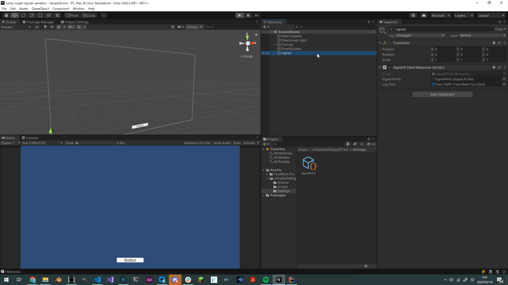

# UnityNuGet SignalR Sandbox

## About

UnityNuGetからインポートしたSignalR Clientパッケージを使用して
リアルタイム通信を実装するサンプル。

## Env

- Windows 10 Home
- Unity 2020.3.20
- Microsoft.AspNetCore.SignalR.Client

## Install & Usage

### Azureリソースの作成

Azure PortalからSignalR Serviceリソースを作成する。
今回はServerless Modeで動作し、
Azure Functionsに`/negotiate`と`/send`というエンドポイントを作成している。
`/send`にGETかPOSTをするとSignalRクライアントに文字列が通知される前提のプロジェクト。

### Unityでの作業

まず`Assets/Settings/`にCreateメニューからSignalRInfoという
ScriptableAssetsを作成し、そこにnegotiateで使用するURLを追加。

そして`Assets/UnityNuGetSIgnalRTest/Scenes/SampleScene.unity`を開きPlay。

## Contact

何かございましたら[にー兄さんのTwitter](https://twitter.com/ninisan_drumath)
までご連絡ください。